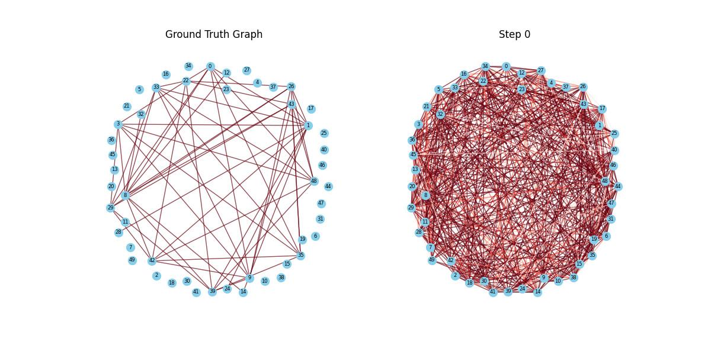

# FlavorDiffusion

FlavorDiffusion is a diffusion-based graph restoration project aimed at learning graph embeddings. This project addresses the biased node connections and excessive sampling of certain nodes in the random walk-based sampling of the FlavorGraph model. By restoring connections between nodes, FlavorDiffusion confirms the ability to learn structural information in the embedding space.

FlavorDiffusion enables the inference of overall node relationships within graphs composed of ingredient and chemical nodes using AI, demonstrating significant potential for applications in the food business.

---

## Key Features

- **Diffusion Model**: Utilizes Gaussian-based DDPM (Denoising Diffusion Probabilistic Models) for graph restoration.
- **Graph Network**: Inspired by Difusco, the graph network is carefully designed to capture node relationships.
- **Subgraph Sampling**: Various subgraph sizes are sampled based on the number of nodes and used for training.

---

## Directory Structure

```plaintext
|-- FlavorDiffusion.html
|-- diffusion_animation.gif
|-- diffusion_steps_comparison.png
|-- make_dataset.py
|-- output_subgraphs
|   |-- 100
|   |   |-- subgraphs_test.json
|   |   |-- subgraphs_train.json
|   |   `-- subgraphs_val.json
|   |-- 200
|   |   |-- subgraphs_test.json
|   |   |-- subgraphs_train.json
|   |   `-- subgraphs_val.json
|   |-- 25
|   |   |-- subgraphs_test.json
|   |   |-- subgraphs_train.json
|   |   `-- subgraphs_val.json
|   `-- 50
|       |-- subgraphs_test.json
|       |-- subgraphs_train.json
|       `-- subgraphs_val.json
|-- read_dataset.py
|-- run.sh
|-- runs
|   |-- run_plot_and_eval.sh
|   |-- run_train_100.sh
|   |-- run_train_100_CSP.sh
|   |-- run_train_200.sh
|   |-- run_train_200_CSP.sh
|   |-- run_train_25.sh
|   |-- run_train_25_CSP.sh
|   |-- run_train_50.sh
|   `-- run_train_50_CSP.sh
`-- src
    |-- FlavorDiffusion.py
    |-- flavor_datasets
    |   |-- __init__.py
    |   `-- graph_dataset.py
    |-- models
    |   |-- __init__.py
    |   |-- ema.py
    |   |-- gnn_encoder.py
    |   `-- nn.py
    |-- plot_and_eval.py
    |-- train.py
    `-- utils
        |-- __init__.py
        |-- diffusion_schedulers.py
        |-- eval.py
        |-- lr_schedulers.py
        |-- plotter.py
        `-- utils.py
```

---

## Subgraph Sampling

Refer to `make_dataset.py` for subgraph sampling. 

- **Train Set**:
  - 25 nodes: 256,000 graphs
  - 50 nodes: 128,000 graphs
  - 100 nodes: 64,000 graphs
  - 200 nodes: 32,000 graphs

- **Validation Set**:
  - 25 nodes: 256 graphs
  - 50 nodes: 128 graphs
  - 100 nodes: 64 graphs
  - 200 nodes: 32 graphs

---

## Visualization

### Diffusion Process

#### Diffusion Animation


#### Diffusion Steps Comparison


#### HTML Visualization
Additional visual materials for FlavorDiffusion can be viewed in [FlavorDiffusion.html](FlavorDiffusion.html). Open the HTML file directly for more details.

---

## Experimental Results

The performance comparison between the FlavorGraph model and the FlavorDiffusion model is as follows:

| **Option**                          | **NMI Mean** | **NMI Std** |
|-------------------------------------|--------------|-------------|
| FlavorGraph (w/o CSP layer)         | 0.2995       | 0.0403      |
| FlavorGraph (w/ CSP layer, emb.)    | 0.3102       | 0.0407      |
| Flavor Diffusion (25 nodes)         | 0.3152       | 0.0178      |
| Flavor Diffusion (50 nodes)         | 0.3160       | 0.0221      |
| Flavor Diffusion (100 nodes)        | 0.2886       | 0.0245      |
| Flavor Diffusion (200 nodes)        | 0.2977       | 0.0295      |

FlavorDiffusion showed excellent performance on small graphs and demonstrated its potential for larger graphs. Research is ongoing to further improve these results.

---

## Future Directions

FlavorDiffusion's embedding learning and graph restoration capabilities are expected to be utilized in various food business applications. For example, new recipe recommendation systems based on the relationships between food ingredients can be developed.
